## Project 1 Documentation on LAMP Stack setup process

#Update packages in package manager

`sudo apt update`
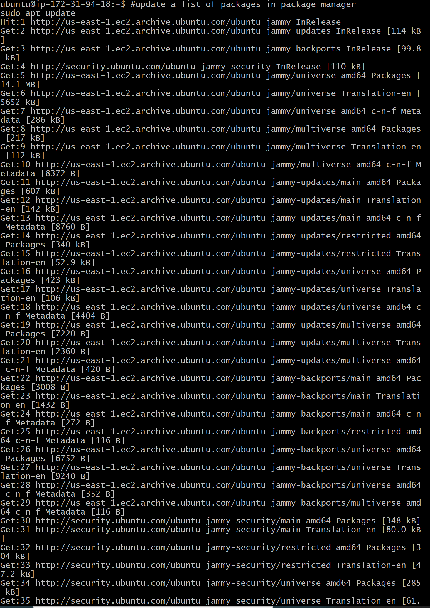

#Step 1 - Apache Setup
#run apache2 package installation

`sudo apt install apache2`
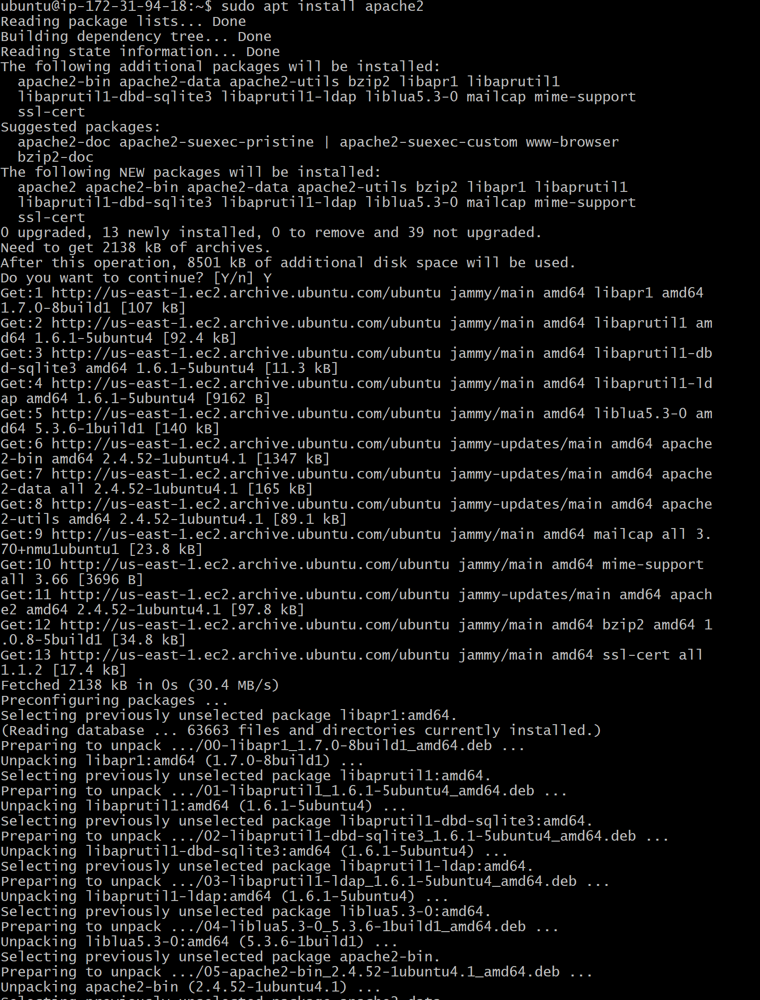

#check if Apache service is running

`sudo systemctl status apache2`
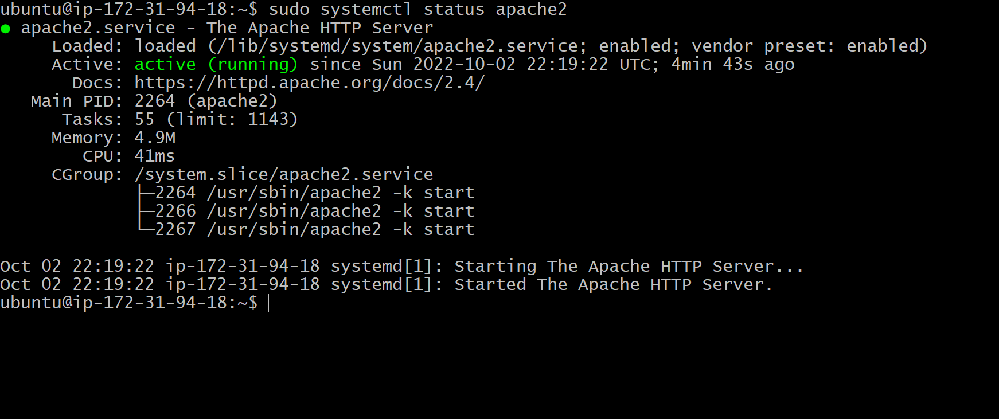

#check the html scrip to confirm apache is setup

`curl http://localhost:80`
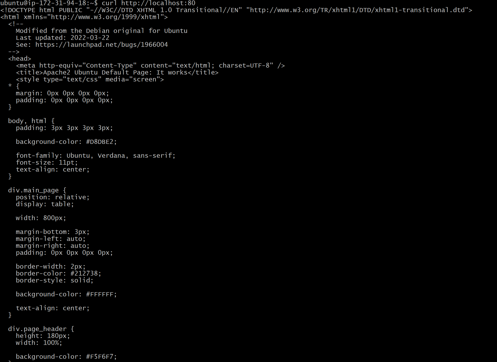

#access Apache from Browser by replacing public ip with public ip from the EC2 Instance

`http://<Public-IP-Address>:80`
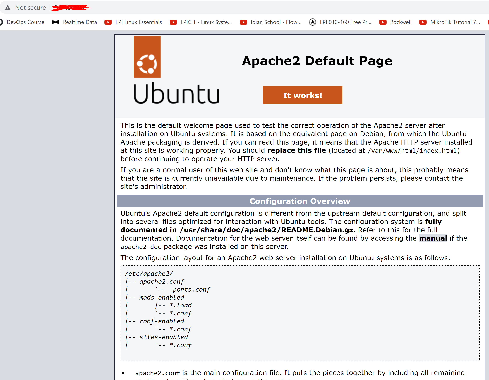

#STEP 2 - Mysql Setup

#Install MySQL

`sudo apt install mysql`

#logon to Mysql
#ALTER USER 'root'@'localhost' IDENTIFIED WITH mysql_native_password BY 'PassWord.1';

`sudo mysql`
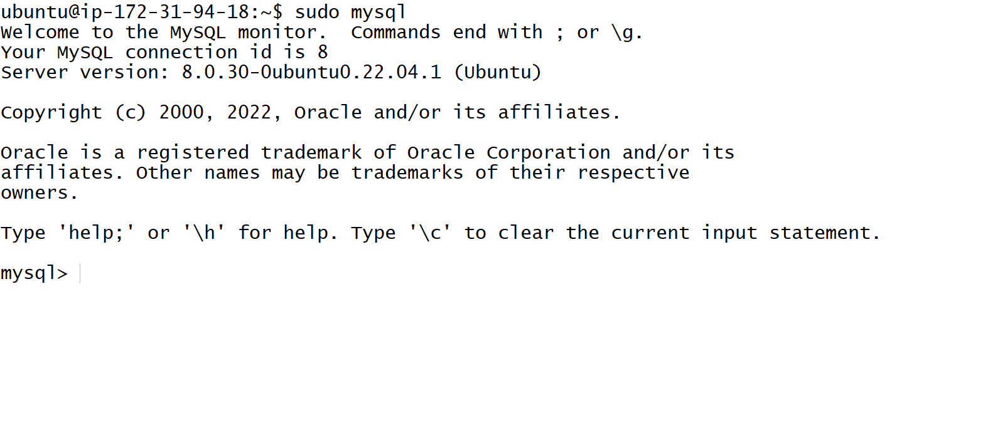

#Interactive script to setup MySQL

`sudo mysql_secure_installation`
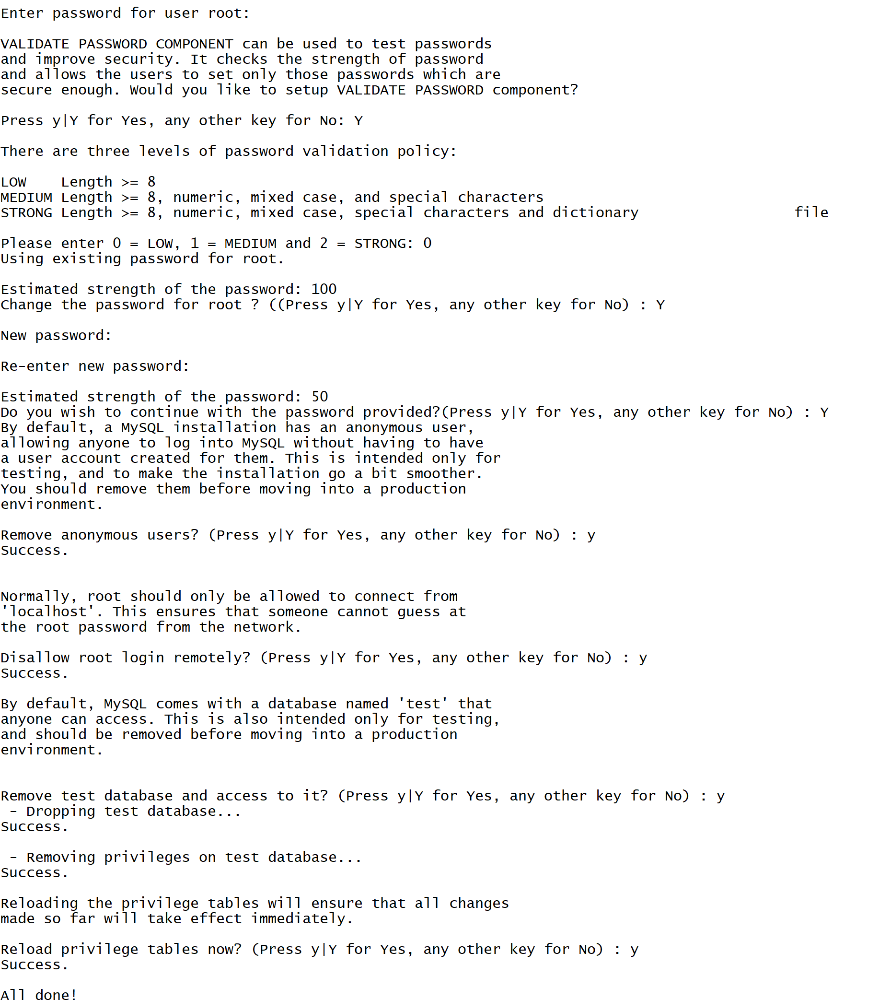

#Test MySQL logon

`sudo mysql -p`
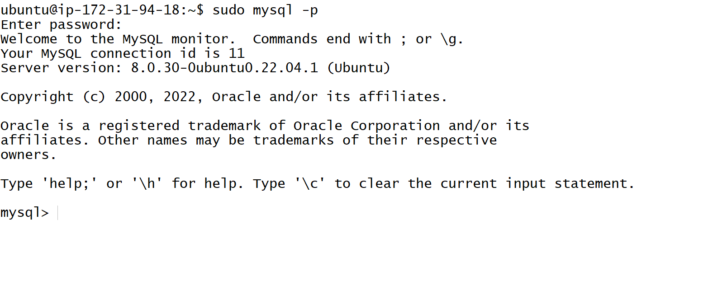

#then exit MySQL.

#STEP 3 - PHP Setup

#Install PhP and packages to enable connection to MySQL and Apache Server

`sudo apt install php libapache2-mod-php php-mysql`

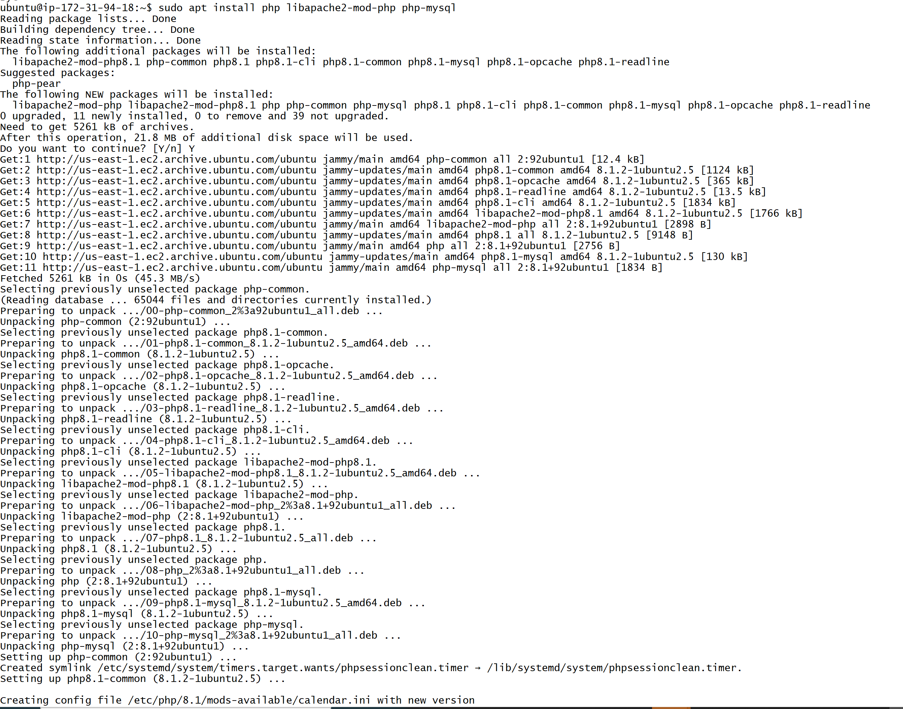

#php_version

`php -v`
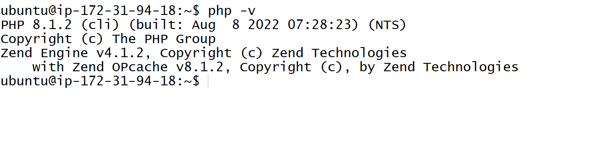

#STEP -4: Creating a virtual host for your website using Apache

#server documents from a different directory from the deafult

#create a directory for use

`sudo mkdir /var/www/projectlamp`

#Assisgn ownership with current user

`sudo chown -R $USER:$USER /var/www/projectlamp`

#create a new configuration file for Apache

`sudo vi /etc/apache2/sites-available/projectlamp.conf`

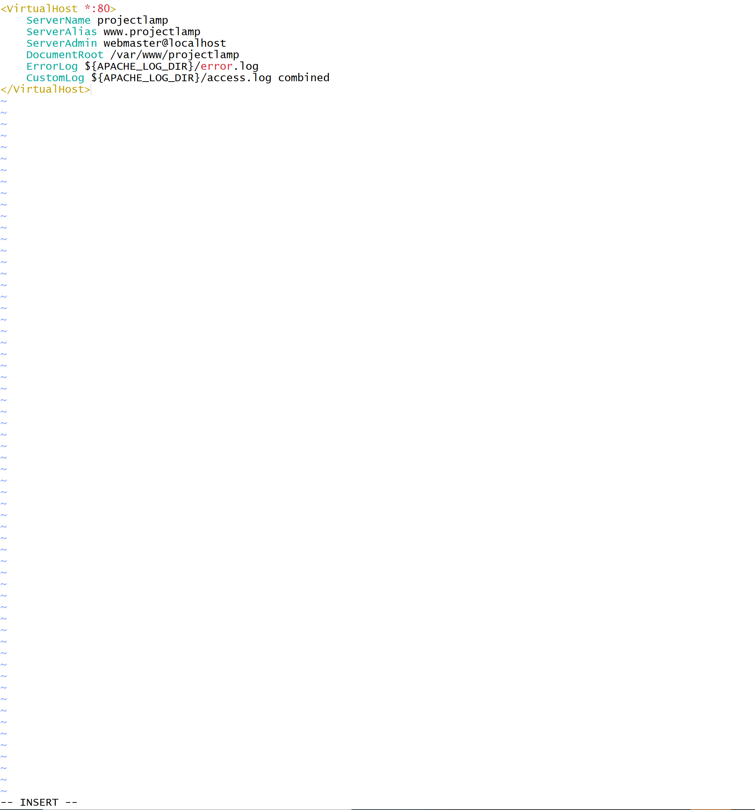

#confirm file is created

`sudo ls /etc/apache2/sites-available`

#enable virtual host for

`sudo a2ensite projectlamp`

#load apache to confirm changes takes effect

`sudo systemctl reload apache2`

#enable virtual host for use and disable apache default website

`sudo a2ensite projectlamp`

`sudo a2dissite 000-default`

#reload apache for changes to take effect

`sudo systemctl reload apache2`

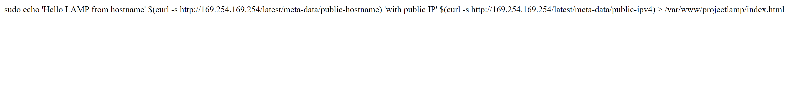

#change priority of index.html and index.php file to make index.php file come first

`sudo vim /etc/apache2/mods-enabled/dir.conf`

#after updating the file there is a need to reload apache

`sudo systemctl reload apache2`

#create a custom php script for test

`vim /var/www/projectlamp/index.php`

#<?php
phpinfo();

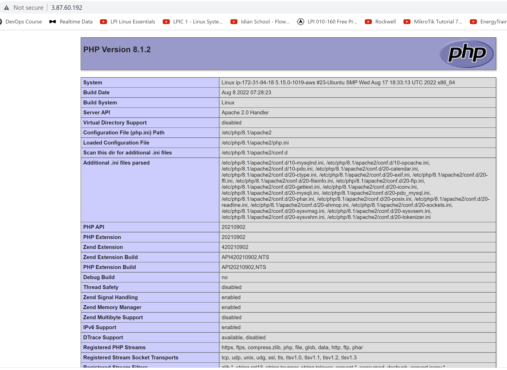

remove php file for security

`sudo rm /var/www/projectlamp/index.php`